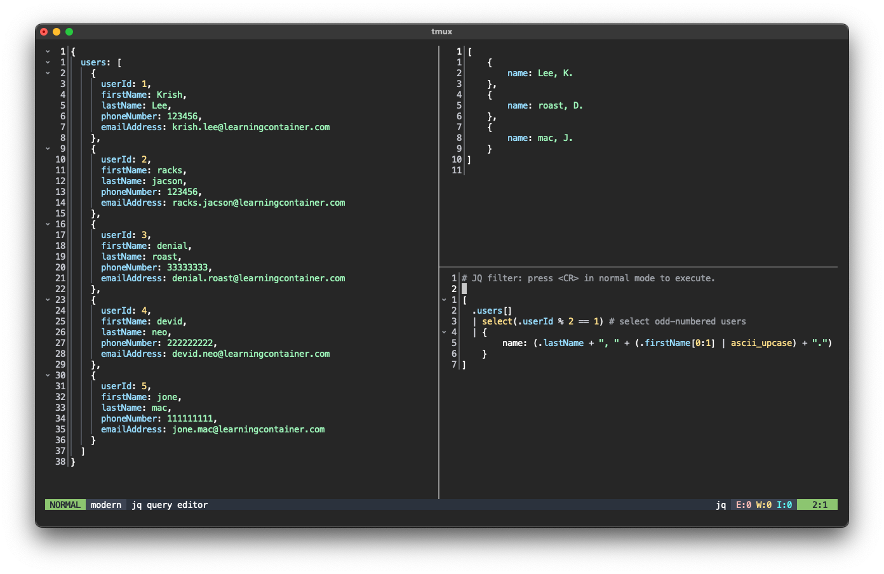

# jq-playground.nvim

> Interact with jq in Neovim, using interactive buffers



Like [jqplay.org](https://jqplay.org) or Neovims builtin Treesitter playground
([`:InspectTree`](https://neovim.io/doc/user/treesitter.html#%3AInspectTree)).

## Setup

Using the default configuration with
[lazy.nvim](https://github.com/folke/lazy.nvim) as package manager:

```lua
{
  "yochem/jq-playground.nvim",
}
```

This will lazy-load the plugin on `:JqPlayground`, as defined in the
[packspec](https://github.com/neovim/packspec) (which Lazy supports) in this
repo: [pkg.json](./pkg.json).

If you use another package manager than lazy.nvim, make sure to run the setup
function to register the `:JqPlayground` command:

```lua
require("jq-playground").setup()
```

## Configuration

There are options available for defining the window layout. These are the
options, along with their defaults:

```lua
require("jq-playground").setup({
  output_window = {
    split_direction = "right",
    width = nil,
    height = nil,
  },
  query_window = {
    split_direction = "bottom",
    width = nil,
    height = 0.3,
  },
  query_keymaps = {
    { "n", "<CR>" },
  },
})
```

- `split_direction`: can be `"left"`, `"right"`, `"above"` or `"below"`. The
  split direction of the output window is relative to the input window, and the
  query window is relative to the output window.
- `width` and `height`:
  - `nil`: use the default (half of current width/height)
  - `0-1`: percentage of current width/height
  - `>1`: absolute width/height in number of characters or lines
- `query_keymaps`: keymaps to refresh the output buffer. Should be given as a table of first two arguments for `vim.keymap.set`. Changing this setting will override the default keymap (<CR> in normal mode).

## `:JqPlayground`

Navigate to a JSON file, and execute the command `:JqPlayground`. Two scratch
buffers will be opened: a buffer for the JQ-filter and one for displaying the
results. Simply press `<CR>` (enter), or your keymap from setup in the filter window to refresh the
results buffer.

You can also provide a filename to the `:JqPlayground` command. This is useful
if the JSON file is very large and you don't want to open it in Neovim
directly:

```
:JqPlayground sample.json
```

## Tips

If you have a saved filter that you want to load into the filter window, then
run:

```
:r /path/to/some/query.jq
```

If you want to save the current query or output json, navigate to that buffer
and run:

```
:w /path/to/save/{query.jq,output.json}
```

If you want to use a keymap instead of the `:JqPlayground` command, use this:

```lua
vim.keymap.set('n', '<leader>jq', vim.cmd.JqPlayground)
```

Start the JQ editor from the command line without loading the input file:

```
$ nvim +'JqPlayground input.json'
```
